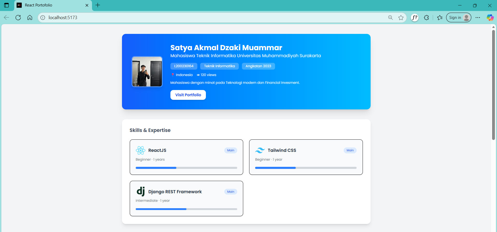
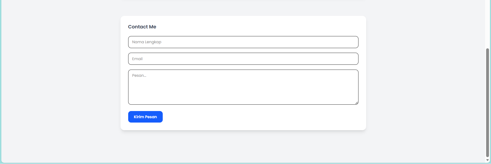
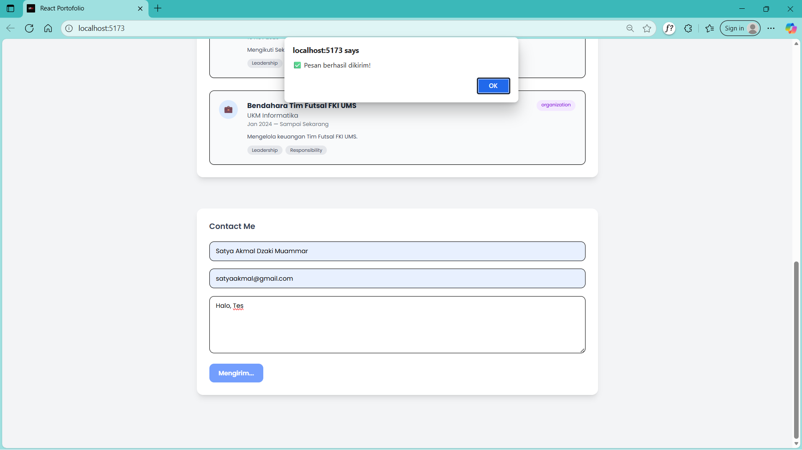
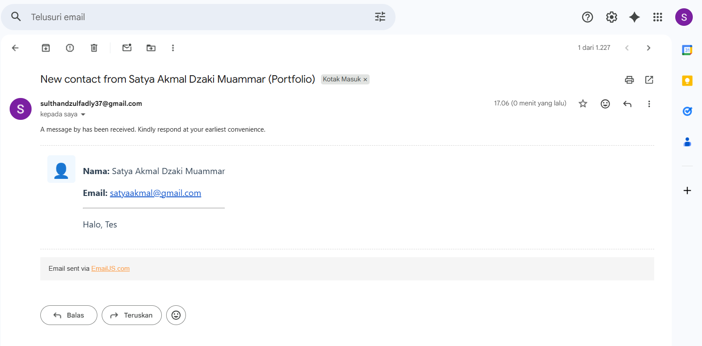

# 📄 ASSIGNMENT 1 – Single Page Application (SPA) using ReactJS to Display Student CV

**Nama**: Satya Akmal Dzaki Muammar  
**NIM**: L200230164
**Kelas**: Pemrograman Web Berbasis Framework C
**Deployment**: Netlify

## Deskripsi Aplikasi

Aplikasi ini merupakan Single Page Application (SPA) berbasis React.js yang digunakan sebagai portfolio/CV mahasiswa. Aplikasi menampilkan beberapa bagian utama, yaitu:

1. Profile / Header: Menampilkan nama, status mahasiswa, asal, jumlah viewers, foto profil, dan tombol menuju portfolio.
2. Skills & Expertise: Menampilkan daftar skill dengan level, lama pengalaman, icon, dan progress bar.
3. Experience: Menampilkan pengalaman organisasi, event, dan aktivitas yang pernah diikuti.
4. Contact Me: Form kontak untuk mengirim pesan langsung ke email menggunakan EmailJS.

Aplikasi ini dibangun menggunakan:

1. React.js
2. Vite
3. Tailwind CSS
4. EmailJS

## Cara Menjalankan Project

1. Clone Repository: Melakukan cloning dengan link HTTPS pada github repository.
2. Install Dependency: Melakukan instalasi dengan "npm install".
3. Konfigurasi Environment: Buat file .env di root project dan isi dengan format berikut:
   VITE_EMAILJS_SERVICE_ID=your_service_id
   VITE_EMAILJS_TEMPLATE_ID=your_template_id
   VITE_EMAILJS_PUBLIC_KEY=your_public_key
4. Menjalankan Aplikasi: Menjalankan aplikasi dengan perintah "npm run dev".
5. Aplikasi akan berjalan pada browser melalui localhost yang diberikan.

## Penjelasan Struktur Folder

1. Pada folder public
   -Favicon.ico : Merupakan icon untuk mengubah icon default pada browser.
   -foto-profil.jpg : Digunakan sebagai foto profil yang ditampilkan dihalaman profil.
2. Pada src/components (komponen utama)
   -Contact.jsx
   -Experiences.jsx
   -Profile.jsx
   -Skills.jsx
3. Pada src/data
   -dataMahasiswa.json : Merupakan tempat menyimpan Data Diri Mahasiswa.
4. Pada folder root
   -App.jsx
   -index.css
   -main.jsx
   -.env
   -.gitignore
   -Doc.md
   -index.html
   -eslint.config.js
   -package-lock.json
   -package.json
   -README_EN.md
   -README.md
   -vite.config.js

## Screenshots Project

1. 
2. 
3. 
4. 
5. 

## Deployment Link
